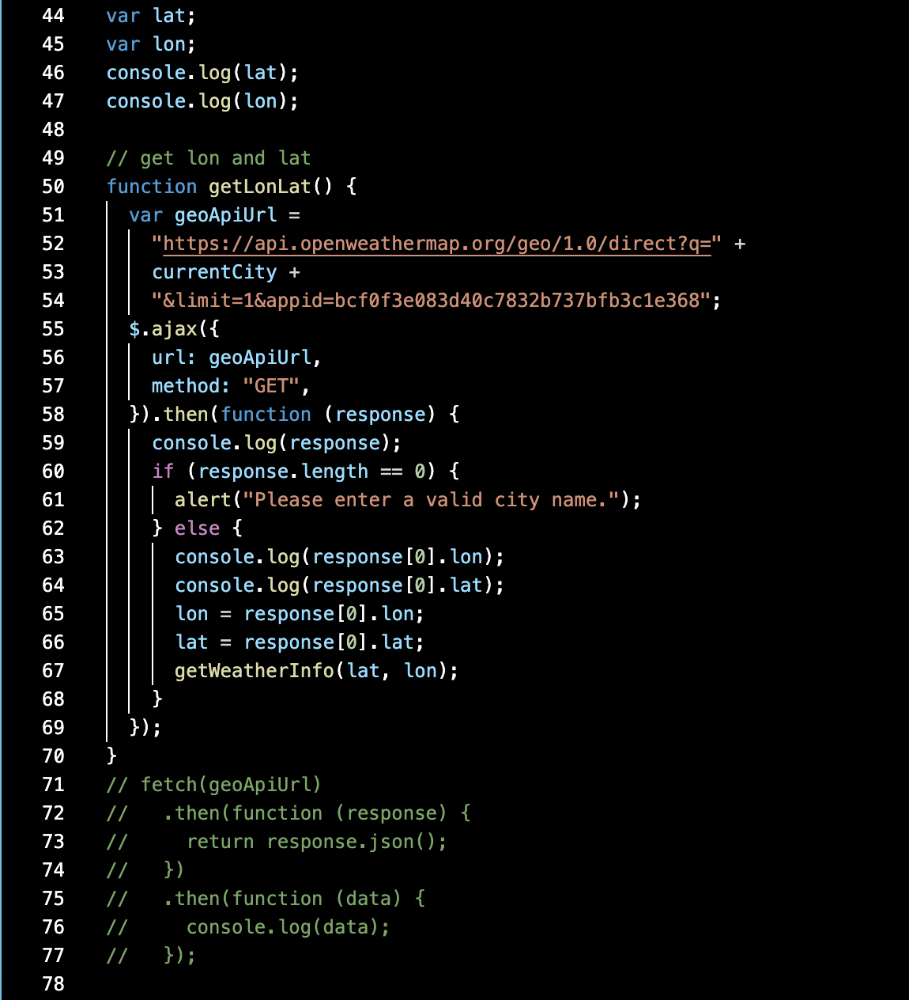

# weather-dashboard
Are you ever on the move and need to know the weather in multiple locations. Well you’re in the right spot.  With the weather dashboard you will be able to look up the weather in in city. Just end the cities name that you will be visiting and you’ll be off to either enjoying the weather or finding some cover to get out of it.  This was my first attempt and implementing APIs.  This utilizes the Openwether api and pieces out just info that’s important to you. I was able to use the fetch method by mean of jquerys Ajax. This was also my first time dealing with a UNIX time stamp and learned how to convert that to a usable format using moment.js. Hope you enjoy.

## Screen Shot

This is where i started with the fetch and after got working i switched to the ajax to familiarize myself with both. This is also where i became more comfortable with passing a variable from one function to another so that you can use it globaly.

## Built With
​
* [HTML](https://developer.mozilla.org/en-US/docs/Web/HTML)
* [CSS](https://developer.mozilla.org/en-US/docs/Web/CSS)
* [Javascript](https://developer.mozilla.org/en-US/docs/Web/javascript)
* [JQuery](https://jquery.com/)
* [Bootstrap](https://getbootstrap.com/)
* [Moment.js](https://momentjs.com/)
​
## Deployed Link
​
* [See Live Site](https://erikgustuson.github.io/weather-dashboard/)
​
​
## Authors
​
* Erik Gustuson 
​
- [Link to Portfolio Site](https://erikgustuson.github.io/basic-portfolio/)
- [Link to Github](https://github.com/ErikGustuson)
- [Link to LinkedIn](https://www.linkedin.com/in/erik-gustuson/)
​
## License
​

MIT License

Copyright (c) [2021] [Erik Gustuson]

Permission is hereby granted, free of charge, to any person obtaining a copy of this software and associated documentation files (the "Software"), to deal in the Software without restriction, including without limitation the rights to use, copy, modify, merge, publish, distribute, sublicense, and/or sell copies of the Software, and to permit persons to whom the Software is furnished to do so, subject to the following conditions:

The above copyright notice and this permission notice shall be included in all copies or substantial portions of the Software.

THE SOFTWARE IS PROVIDED "AS IS", WITHOUT WARRANTY OF ANY KIND, EXPRESS OR IMPLIED, INCLUDING BUT NOT LIMITED TO THE WARRANTIES OF MERCHANTABILITY, FITNESS FOR A PARTICULAR PURPOSE AND NONINFRINGEMENT. IN NO EVENT SHALL THE AUTHORS OR COPYRIGHT HOLDERS BE LIABLE FOR ANY CLAIM, DAMAGES OR OTHER LIABILITY, WHETHER IN AN ACTION OF CONTRACT, TORT OR OTHERWISE, ARISING FROM, OUT OF OR IN CONNECTION WITH THE SOFTWARE OR THE USE OR OTHER DEALINGS IN THE SOFTWARE.